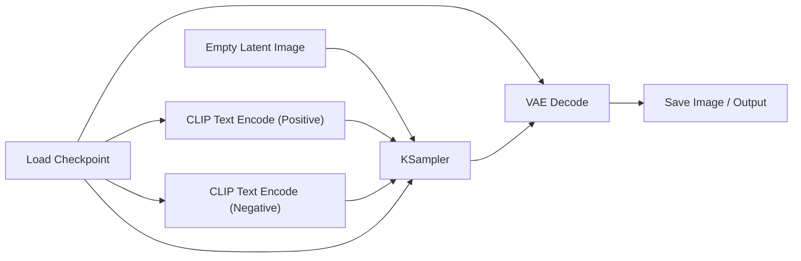

# System Architecture & Technical Specifications

This document defines the architectural blueprints, execution pipelines, data contracts, and isolation models for **AI-Workflow**.

---

## 1. Architectural Philosophy

ComfyUI is a powerful node-based engine, but its UI exposes low-level model mechanics (CLIP, VAE, Latent vectors, samplers, schedules). This creates:
1. **The "Spaghetti Wire" problem**: Novice creators must connect 8–12 nodes just to render a single picture.
2. **Heavyweight Barriers**: Demands 16GB+ VRAM GPUs, CUDA installation, and tens of gigabytes of checkpoint weights.
3. **System Environment Pollution**: Conflicts between PyTorch versions, CUDA toolkits, and Python wheels often break the host environment.

**AI-Workflow** solves these challenges by inverting the paradigm:
- **High-Level Semantic Nodes**: Users work with functional building blocks (e.g., "Script Expander", "FLUX Generator", "Voiceover TTS", "Background Remover").
- **API-First by Default**: 100% lightweight, boots in milliseconds, runs on any laptop or server using cloud APIs.
- **Pluggable & Sandboxed Local Engine**: Local models (like ComfyUI) can be linked or installed directly via the app into an isolated, self-contained runtime that **never pollutes the host operating system**.

---

## 2. Multi-Tier System Topology

```mermaid
flowchart TD
    subgraph Client ["Client / Presentation Layer"]
        Canvas["@xyflow/react Canvas"]
        Inspector["Node Inspector & Controls"]
        Store["Zustand Store (Nodes, Edges, Cache)"]
    end

    subgraph CoreEngine ["Backend Core (FastAPI / Python AsyncIO)"]
        DAG["DAG Graph Resolver & TopoSort"]
        Hasher["Dirty-Check & State Hashing Engine"]
        CacheStore["Hash Cache Store (SQLite / In-Memory)"]
        Router["Execution Runner Router"]
    end

    subgraph Runners ["Pluggable Execution Drivers"]
        APIRunner["Cloud API Driver<br/>(OpenAI, DeepSeek, Fal.ai, SiliconFlow)"]
        ComfyBridge["ComfyUI Runner Adapter<br/>(WebSocket + Subgraph Compiler)"]
        LocalTools["Lightweight Local Processors<br/>(rembg, whisper, ffmpeg)"]
    end

    subgraph SandboxedRuntime ["Sandboxed Local ComfyUI Engine (Optional)"]
        Supervisor["Runtime Process Supervisor"]
        IsolatedEnv["Isolated Virtualenv / uv Sandbox<br/>(Zero Host Pollution)"]
        ComfyInstance["Headless ComfyUI Server<br/>(Port: 8188 / Dynamic)"]
    end

    Canvas <-->|REST & WebSocket| CoreEngine
    DAG --> Hasher
    Hasher -->|Cache Miss| Router
    Hasher -->|Cache Hit (0 token cost)| Store
    Router --> APIRunner
    Router --> ComfyBridge
    Router --> LocalTools
    ComfyBridge <-->|IPC / WS Protocol| ComfyInstance
    Supervisor --> IsolatedEnv
    Supervisor --> ComfyInstance
```

---

## 3. The 5 Universal Data Types

To eliminate interface explosion, all node input and output ports are strictly typed into one of 5 universal primitives:

| Type | Data Format | Description |
| :--- | :--- | :--- |
| **`string`** | UTF-8 String | Prompts, subtitles, formatted markdown, LLM responses. |
| **`image`** | URL or Base64 / URI | Image assets (PNG, WebP, JPEG). |
| **`audio`** | URL or Audio File URI | Voiceover recordings, sound effects, BGM. |
| **`video`** | URL or MP4/WebM URI | Video clips, animations. |
| **`json`** | Structured Object / Array | Batch variables, parameters, split outputs. |

### Smart Auto-Casting
Nodes automatically cast compatible types:
- An `image` connected to a multimodal LLM prompt is interpreted as a visual reference frame.
- A `string` representing a valid image URL connected to an `image` port is treated as an image input.

---

## 4. Deterministic Dirty-Check & Caching Engine

API calls incur real financial cost. A creator who edits only the last step of a workflow should never re-pay for preceding steps.

### Hash Derivation Formula
Every node's cache key is deterministically calculated as:
$$\text{NodeHash} = \text{SHA256}(\text{NodeType} + \text{SerializedParameters} + \sum_{p \in \text{Parents}} \text{ParentOutputHash}_p)$$

### Execution Cycle:
1. When a workflow run is requested (or single-node run), the DAG engine topologically sorts active nodes.
2. For each node, it computes the `NodeHash`.
3. If `CacheStore.has(NodeHash)`:
   - Output data is pulled from cache instantly.
   - Real-time event `NODE_CACHED` is broadcast to the canvas (rendered with a green status badge).
   - Zero external API tokens consumed.
4. If `CacheStore.miss(NodeHash)`:
   - The node is queued for execution via its designated runner.
   - Status updates stream over WebSocket (`NODE_RUNNING` $\to$ `NODE_PROGRESS` $\to$ `NODE_COMPLETED`).
   - The final output is committed to the cache store alongside its hash.

---

## 5. Sandboxed & Isolated ComfyUI Runtime Engine

Users can install and run ComfyUI directly through our app with **zero system environment pollution**.

```
Host OS (Clean, Unmodified)
└── User Data Directory (~/.ai-workflow/engine/)
    ├── runtime/                     <-- Standalone Python / uv virtualenv
    │   ├── bin/ (or Scripts/)
    │   └── lib/site-packages/       <-- PyTorch, CUDA bindings, Comfy packages
    ├── comfyui/                     <-- Isolated ComfyUI source clone / bundle
    │   ├── main.py
    │   ├── custom_nodes/
    │   └── models/                  <-- Checkpoints, LoRA, VAE
    └── supervisor.pid               <-- Managed process daemon
```

### Key Isolation Guarantees:
1. **Hermetic Virtual Environment**:
   - The embedded ComfyUI runs within a dedicated isolated directory (e.g. `%LOCALAPPDATA%\AI-Workflow\engine` on Windows or `~/.ai-workflow/engine` on Linux/macOS).
   - Packaged and managed using standalone `uv` or portable embedded Python packages.
   - Never runs `sudo pip` or modifies global Python site-packages.
2. **Lifecycle Process Supervisor**:
   - The backend process supervisor manages starting, stopping, health-checking, and port management (`localhost:8188` or dynamic fallback if 8188 is occupied).
   - Graceful termination on application exit to avoid orphan GPU memory leaks.
3. **Dual Connection Modes**:
   - **Mode A (External Bridge)**: If the user already has ComfyUI running, the app directly connects to `http://127.0.0.1:8188` without installing anything.
   - **Mode B (In-App Sandboxed Installer)**: One-click setup managed via the Settings dialog, downloading only required runtime packages inside the sandbox.

---

## 6. Macro Subgraph Compilation

To keep the canvas clean, our high-level nodes automatically compile into ComfyUI's internal execution graph (the `/prompt` JSON format) behind the scenes.

### Compilation Example: `Local Txt2Img Node`

**What the user sees on our Canvas:**
```text
┌──────────────────────────────────────┐
│  Local SDXL Txt2Img                  │
├──────────────────────────────────────┤
│ ● in: prompt (string)                │
│ ● in: lora_name (optional string)    │
├──────────────────────────────────────┤
│ [Checkpoint: Juggernaut-XL-v9]       │
│ [Steps: 25 | CFG: 7.0]               │
├──────────────────────────────────────┤
│ ● out: image (image)                 │
└──────────────────────────────────────┘
```

**Compiled ComfyUI Subgraph submitted via WebSocket:**


The user never manages latent connections, conditioning wires, or VAE decoders.

---

## 7. WebSocket Event Protocol

All real-time updates between backend and frontend follow a typed JSON event schema:

```typescript
type WorkflowEvent =
  | { type: 'GRAPH_STARTED'; totalNodes: number }
  | { type: 'NODE_STATUS'; nodeId: string; status: 'IDLE' | 'QUEUED' | 'RUNNING' | 'CACHED' | 'COMPLETED' | 'ERROR' }
  | { type: 'NODE_PROGRESS'; nodeId: string; progress: number; message?: string }
  | { type: 'NODE_OUTPUT'; nodeId: string; output: Record<string, any> }
  | { type: 'GRAPH_FINISHED'; executionTimeMs: number; tokensUsed?: number }
  | { type: 'ENGINE_STATUS'; engine: 'cloud' | 'comfyui'; online: boolean; vramFreeMb?: number };
```
