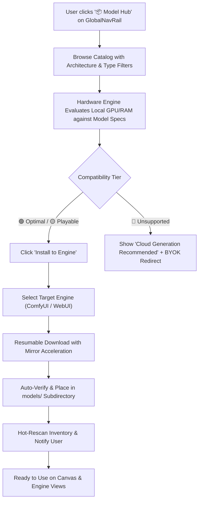

# Berry AI Studio Model Hub & Hardware-Aware Downloader PRD

Date: 2026-10-03  
Status: Approved Architecture Specification  
Target Version: v0.2.0  
Authors: Berry AI Studio Core Engineering Team  
Governing Documents: [`docs/PRODUCT_VISION.md`](PRODUCT_VISION.md), [`docs/PRD.md`](PRD.md), [`docs/ARCHITECTURE.md`](ARCHITECTURE.md), [`docs/ROADMAP_POST_V0_1.md`](ROADMAP_POST_V0_1.md), [`docs/LAUNCHER_HUB_PRD.md`](LAUNCHER_HUB_PRD.md).

---

## 1. Executive Summary

### 1.1 Problem Statement
In open-source generative AI tools (such as ComfyUI and Stable Diffusion WebUI), acquiring models presents three major barriers to non-technical creators:
1. **Discovery & Compatibility Blindness**: Users must manually hunt across sites like Hugging Face and Civitai, guessing whether a checkpoint is SD 1.5, SDXL, FLUX.1, or an inpainting model, and frequently download incompatible weights.
2. **Hardware Out-Of-Memory (OOM) Surprises**: Users blindly download massive 12GB–24GB models (e.g. FLUX.1 [dev] FP16) on 6GB–8GB GPUs, only to experience catastrophic CUDA OOM crashes or freezing systems when running inference.
3. **Network Latency & Download Failures**: In regions such as Mainland China, direct access to Hugging Face or overseas CDNs often fails, hangs, or experiences 50KB/s transfer speeds without mirror proxy acceleration or resumable downloads.

### 1.2 The Solution: Berry Model Hub & Hardware-Aware Downloader
Berry AI Studio provides a first-class, curated **Model Hub (模型市场)** integrated into the primary application navigation shell as a dedicated singleton view (`models`). 

Key innovations:
- **Curated Multi-Architecture Catalog**: Pre-indexed Checkpoints, LoRAs, VAEs, ControlNets, and Upscalers with preview artwork, recommended prompt parameters, and target engine directories.
- **Dynamic 4-Tier Hardware Compatibility Engine**: Analyzes the host's dedicated VRAM and system RAM to compute real-time runnability ratings:
  - 🟢 **Optimal VRAM (极致流畅)**: Native full-speed VRAM execution without host memory offloading.
  - 🟡 **Playable / RAM Offload (换页运行 / 需共享内存)**: Execution requires CPU memory swap/offloading; slower generation, but completely stable.
  - 🟠 **Heavy Paging (严重卡顿)**: Significant memory deficit leading to slow performance; suggests quantized GGUF/FP8 variants.
  - 🔴 **Unsupported / OOM Risk (无法运行 / 易爆显存)**: Hardware cannot satisfy minimum loading threshold; provides 1-click fallback to cloud BYOK generation.
- **Resumable Multi-Source Mirror Acceleration**: Leverages the Berry `MirrorManager` with automatic fallback between Hugging Face Mirrors (`hf-mirror.com`), ModelScope direct links, and multi-chunk resumable HTTP streaming.
- **Zero-Friction Engine Auto-Placement**: Automatically verifies target directories (`models/checkpoints/`, `models/loras/`, etc.), archives downloaded assets, and hot-rescans the model inventory so models appear immediately on the Infinite Canvas and embedded engine interfaces.

---

## 2. User Personas & Core Workflows

### 2.1 Personas
- **The Newcomer Creator (8GB Laptop GPU)**: Wants to generate high-quality anime or photo art without reading Reddit threads about `--medvram` or `--lowvram`. Needs the system to tell them: *"This model will run smoothly, but that 24GB model will crash your laptop—use our cloud button instead."*
- **The Power Artist (24GB RTX 4090 / 3090)**: Wants quick access to the latest FLUX.1, SDXL Turbo, and specialized LoRAs, installed directly into their active ComfyUI instance with verified SHA-256 integrity.
- **The Network-Restricted User**: Located in Mainland China or behind restrictive corporate proxies; requires mirror switching and reliable pause/resume downloads for large files.

### 2.2 Core User Workflows



---

## 3. Hardware Compatibility Rating Engine (The 4-Tier Contract)

### 3.1 Memory Model Formula
When evaluating a model $M$, the engine computes:
$$\text{WeightSizeMB} = M.\text{size\_bytes} / (1024 \times 1024)$$
$$\text{InferenceBufferMB} = \text{BaseResolutionBuffer}(M.\text{architecture}) + \text{KVContextBuffer}$$
$$\text{TotalFootprintMB} = \text{WeightSizeMB} + \text{InferenceBufferMB}$$

Given host telemetry:
- $V_{\text{total}}$: Dedicated GPU VRAM in MB.
- $V_{\text{free}}$: Currently unallocated GPU VRAM in MB.
- $R_{\text{total}}$: Host System Physical RAM in MB.
- $R_{\text{avail}}$: Host System Available RAM in MB.

### 3.2 Tier Definitions

| Tier | Badge | Condition | User Impact | UI Action |
| :--- | :--- | :--- | :--- | :--- |
| **Tier 1: Optimal VRAM** | 🟢 极致流畅 (Optimal) | $V_{\text{total}} \ge \text{TotalFootprintMB} + 2048$ | Native VRAM inference, maximum speed, no CPU swap | Primary "Install" button with estimated gen time (e.g., `~3-8s`) |
| **Tier 2: Playable / RAM Offload** | 🟡 需共享内存 (Playable) | $V_{\text{total}} < \text{TotalFootprintMB}$ **AND** $(V_{\text{total}} + R_{\text{avail}}) \ge \text{TotalFootprintMB} + 4096$ | Stable execution via CPU memory swap / offload; slower speed | "Install (RAM Offload)" button with memory advisory tooltip |
| **Tier 3: Heavy Paging** | 🟠 严重卡顿 (Heavy Paging) | $(V_{\text{total}} + R_{\text{avail}}) \ge \text{TotalFootprintMB}$ **BUT** $R_{\text{avail}} < \text{WeightSizeMB} \times 0.6$ | Host memory swapping under severe pressure; potential UI stutter | Warning prompt before downloading; suggests quantized GGUF/FP8 |
| **Tier 4: Unsupported / OOM** | 🔴 无法运行 (OOM Risk) | $(V_{\text{total}} + R_{\text{avail}}) < \text{TotalFootprintMB}$ OR GPU compute capability < 7.0 | High probability of CUDA OOM or application crash | "Cloud BYOK Recommended" button leading directly to cloud setup |

---

## 4. Model Catalog Architecture & Schemas

### 4.1 Supported Architectures & Categories
- **Architectures**:
  - `flux.1-schnell` (12B distilled high-speed)
  - `flux.1-dev` (12B guidance-distilled research)
  - `sdxl-1.0` / `sdxl-turbo`
  - `sd-1.5` / `sd-1.5-turbo`
  - `illustrious-xl` / `pony-diffusion-v6`
  - `svd-xt` / `cogvideox` (Video Checkpoints)
- **Categories**:
  - `checkpoint` (Base diffusion models $\rightarrow$ `models/checkpoints/` or `models/Stable-diffusion/`)
  - `lora` (Low-rank adaptation weights $\rightarrow$ `models/loras/` or `models/Lora/`)
  - `controlnet` (Spatial conditioning models $\rightarrow$ `models/controlnet/`)
  - `upscaler` (ESRGAN / RealESRGAN / DAT / HAT $\rightarrow$ `models/upscale_models/`)
  - `vae` (Variational autoencoders $\rightarrow$ `models/vae/`)

### 4.2 Curated Registry Schema (`hub_catalog.json`)
The catalog is stored locally in the backend package and can be synchronized dynamically from Berry's official GitHub raw or CDN endpoint:
```json
{
  "id": "flux-1-schnell-fp8",
  "name": "FLUX.1 [schnell] (FP8 Quantized)",
  "architecture": "flux.1-schnell",
  "category": "checkpoint",
  "version": "1.0-fp8",
  "size_bytes": 12800000000,
  "parameter_count": "12B",
  "quantization": "FP8",
  "author": "Black Forest Labs",
  "description": "State-of-the-art fast open-weight image model. Exceptional prompt fidelity and photorealism in 4 steps.",
  "preview_image_url": "/assets/hub/previews/flux_schnell_preview.webp",
  "tags": ["photorealism", "text-rendering", "fast-inference"],
  "recommended_resolution": [1024, 1024],
  "min_vram_mb": 8192,
  "optimal_vram_mb": 16384,
  "sources": [
    {
      "name": "HuggingFace (Direct)",
      "url": "https://huggingface.co/Comfy-Org/flux1-schnell/resolve/main/flux1-schnell-fp8.safetensors"
    },
    {
      "name": "HuggingFace (China Mirror)",
      "url": "https://hf-mirror.com/Comfy-Org/flux1-schnell/resolve/main/flux1-schnell-fp8.safetensors"
    },
    {
      "name": "ModelScope",
      "url": "https://www.modelscope.cn/models/AI-ModelScope/flux1-schnell-fp8/resolve/master/flux1-schnell-fp8.safetensors"
    }
  ],
  "sha256": "4b6c...3a"
}
```

---

## 5. Download Engine & Lifecycle Supervision

### 5.1 Multi-Part Resumable Download Protocol
1. **Head Request Inspection**: Verify `Accept-Ranges: bytes` and fetch `Content-Length`.
2. **Chunk Staging**: Downloads are written to `.part` files in `<target_engine>/models/.cache/`.
3. **Resumption**: If a download disconnects, HTTP `Range: bytes={existing_bytes}-` resumes without data loss.
4. **Checksum & Move**: On completion, SHA-256 integrity is calculated in a streaming background worker. On match, the `.part` file is moved atomically to the target directory (`models/checkpoints/<filename>.safetensors`).
5. **Inventory Notification**: Triggers `model_store.scan_all_roots_async()`, emitting WebSocket event `ModelCatalogUpdatedEvent`.

### 5.2 Concurrent Download Queue Management
- Max concurrent active downloads: 2 by default (configurable 1–4).
- Queued tasks wait in FIFO order with manual reordering support.
- User controls: **Pause**, **Resume**, **Cancel** (cleans up staging cache), and **Retry**.

---

## 6. Security, Isolation, and Safety

1. **Path Traversal Protection**: Model target filenames must not contain relative paths (`..`, `~`) and are sanitized using strict alphanumeric/safe characters.
2. **Malicious Code Prevention**: Exclusively download `.safetensors` format. Refuse downloading `.ckpt` or `.pt` pickle files from the public Model Hub to eliminate arbitrary code execution vulnerabilities.
3. **Disk Space Pre-Allocation**: Before starting download, verify that the destination disk partition has at least `size_bytes * 1.15` free space; alert with actionable guidance if disk is nearly full.
